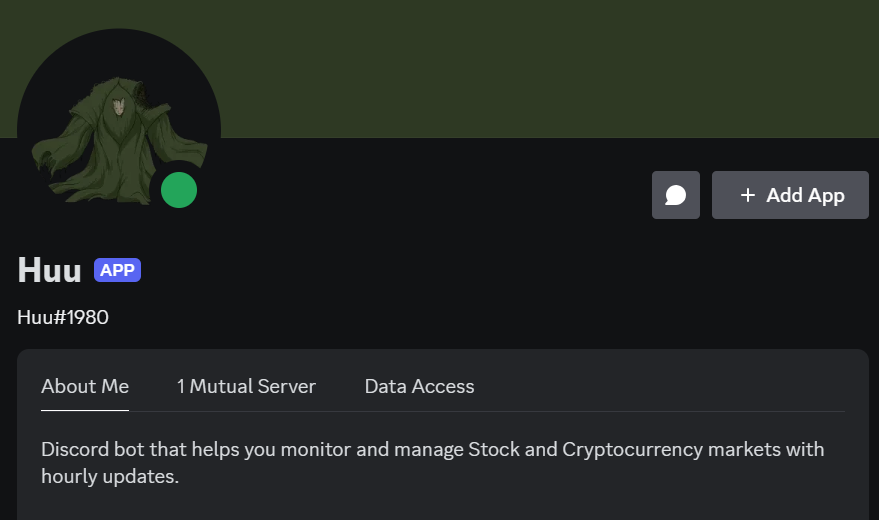
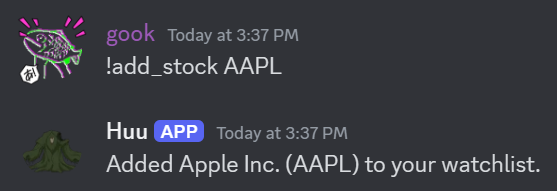

[](https://github.com/gongahkia/huu/releases/tag/1.0.0) 

# `Huu`

Discord bot that monitors your Stock and Cryptocurrency prices and provides optional hourly updates. 

Relies on the following [APIs](#dependancies).

<div align="center">
    
</div>

## Commands

| Command | Description | Example |
| :--- | :--- | :---: |
| `!find_stock <ticker>` | find information about a specific stock |  |
| `!add_stock <ticker>` | add a stock to your watchlist |  |
| `!remove_stock <ticker>` | remove a stock from your watchlist |  |
| `!list_stocks` | list all stocks in your watchlist |  |
| `!find_coin <coin_id>` | find information about a specific cryptocurrency |  |
| `!add_coin <coin_id>` | add a cryptocurrency to your watchlist |  |
| `!remove_coin <coin_id>` | remove a cryptocurrency from your watchlist |  |
| `!list_coins` | list all cryptocurrencies in your watchlist |  |
| `!toggle_updates` | toggle hourly price updates on or off |   |

## Architecture

### Overview


### DB structure


## Usage

The below instructions are for locally hosting `Huu`.

1. Create a [Discord application](https://discord.com/developers/applications) and a bot for that application.
2. Enable the following permissions under *Priviledged Gateway Intents* in the Bot tab.
    1. Presence Intent
    2. Server Members Intent
    3. Message Content Intent
3. Enable the following permissions under *Bot Permissions* in the Bot tab.
    1. Send Messages
4. Create the [Supabase](https://supabase.com/dashboard/projects) tables with the [`create.sql`](./src/create.sql) script.
5. Place your Discord bot token, Supabase URL and Supabase key in a `.env` file within `./src/`.

```env
DISCORD_TOKEN=XXX
SUPABASE_URL=XXX
SUPABASE_KEY=XXX
```

6. Run the following.

```console
$ python3 -m venv myenv
$ source myenv source/bin/activate
$ pip install -r requirements.txt
$ make
```

## Dependancies

`Huu` currently relies on the following APIs.

* [Yahoo Finance API](https://developer.yahoo.com/api/)
* [Finnhub Stock API](https://finnhub.io/)

Alternatives include the below.

* [CoinGecko API](https://www.coingecko.com/en/api)
* [Binance API](https://developers.binance.com/docs/binance-spot-api-docs/rest-api)

## Reference

The name `Huu` is in reference to [Huu](https://avatar.fandom.com/wiki/Huu), the [waterbending](https://avatar.fandom.com/wiki/Waterbending) master of the [Foggy Swamp Tribe](https://avatar.fandom.com/wiki/Foggy_Swamp_Tribe) who uses his [plantbending](https://avatar.fandom.com/wiki/Waterbending#Special_techniques) to masquerade as the [swamp monster](https://atla-lore-archive.tumblr.com/post/170291402650/character-swamp-monster-huu-this-large-scary). He first appears in the [fourth episode](https://avatar.fandom.com/wiki/The_Swamp) of [Book Two: Earth](https://avatar.fandom.com/wiki/Book_Two:_Earth) under the [Nickelodeon](https://avatar.fandom.com/wiki/Nickelodeon) series [Avatar: The Last Airbender](https://avatar.fandom.com/wiki/Avatar:_The_Last_Airbender).

